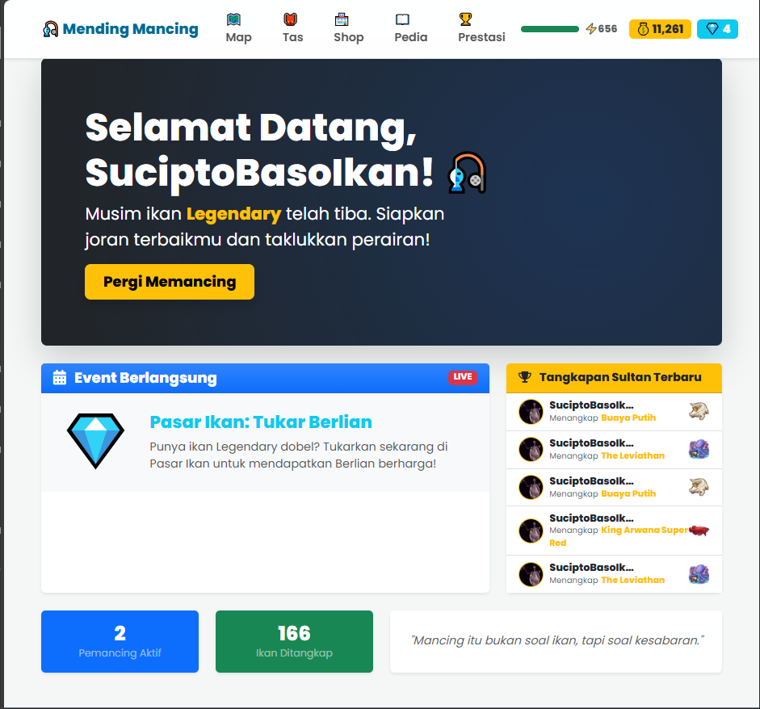
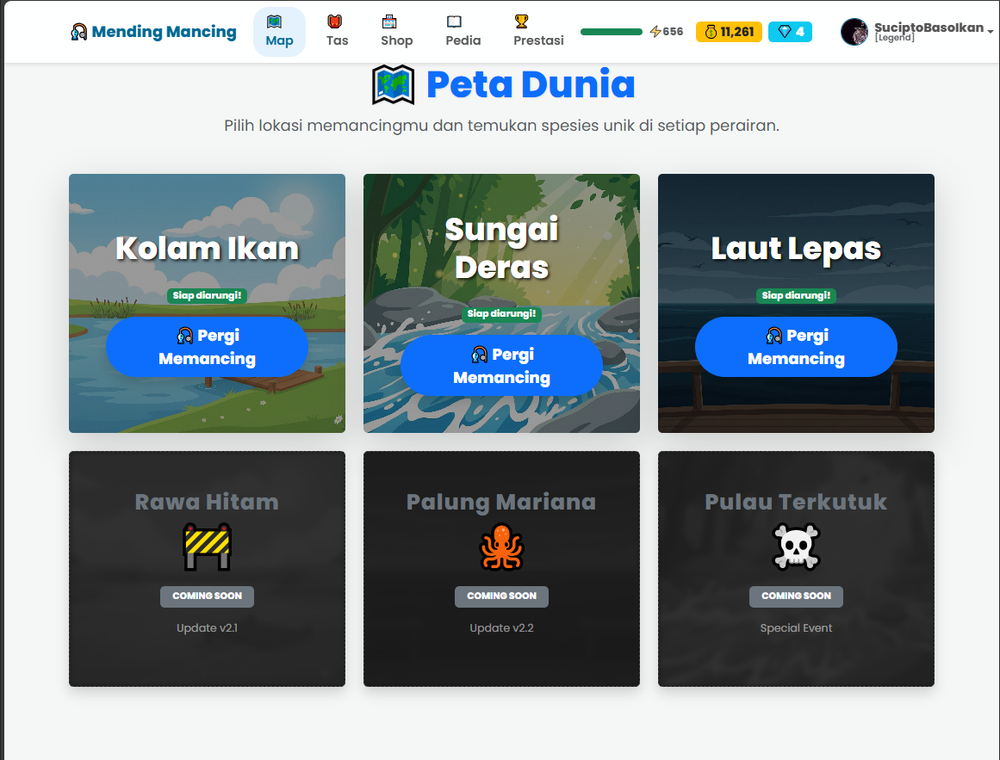
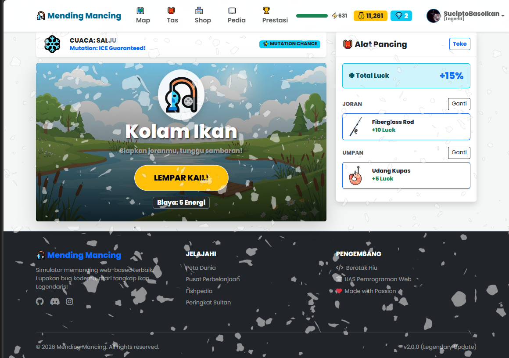
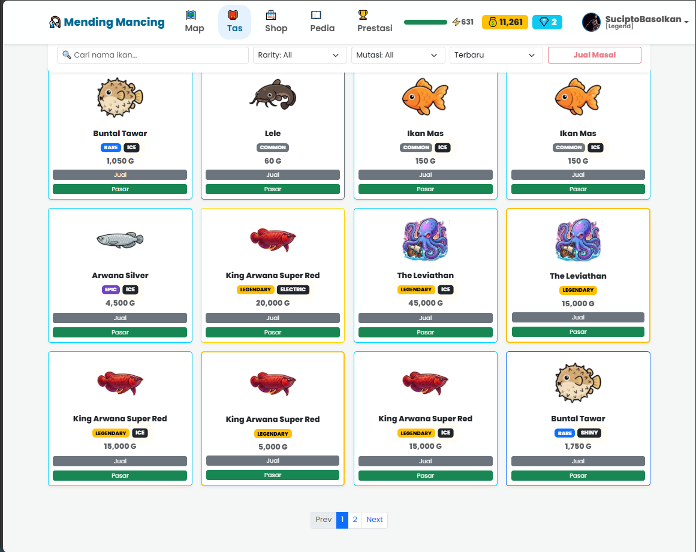
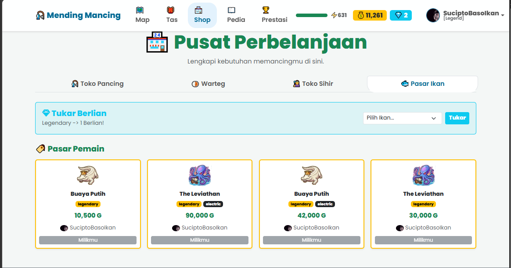
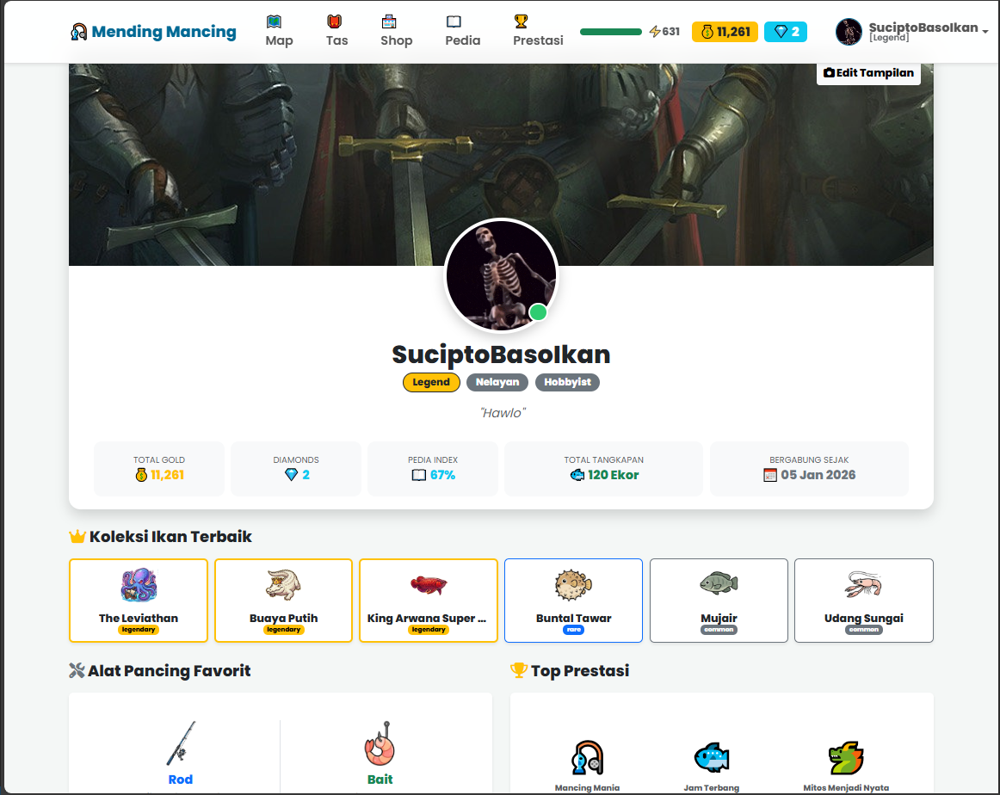

# 🎣 Mending Mancing - Web Based Fishing Simulator



> *"Lupakan bug kodemu, mari tangkap Ikan Legendaris!"*

**Mending Mancing** adalah sebuah game simulasi memancing berbasis web yang dikembangkan menggunakan **PHP Native (MVC Architecture)**. Proyek ini dibuat untuk memenuhi Tugas Akhir (UAS) Pemrograman Web, menggabungkan elemen RPG, strategi ekonomi, dan sistem Gacha (RNG).

## 🌟 Fitur Utama

### 🎮 Gameplay & Core System
* **Sistem Gacha & RNG:** Probabilitas mendapatkan ikan ditentukan oleh statistik **Luck** (dari Joran & Umpan) serta kondisi **Cuaca**.
* **Sistem Energi:** Setiap kali memancing membutuhkan energi. Energi pulih seiring waktu atau dengan membeli makanan di Warteg.
* **Sistem Cuaca Dinamis:** Cuaca (Cerah, Hujan, Badai) berubah secara acak dan mempengaruhi jenis ikan serta drop rate.
* **Mutasi Ikan:** Kesempatan mendapatkan varian ikan unik: *Shiny, Giant, Tiny, dan Glitch*.

### 🌎 Eksplorasi & Progresi
* **Peta Dunia:** 3 Lokasi utama (Kolam Ikan, Sungai Deras, Laut Lepas) + 3 Lokasi "Coming Soon".
* **Sistem Unlock:** Buka map baru menggunakan **Diamond** (Mata uang premium).
* **Leveling Title:** Dapatkan gelar (Pemula, Hobbyist, Legend) berdasarkan progres permainan.

### 💰 Ekonomi & Pasar
* **Toko Pancing:** Beli perlengkapan (Joran & Umpan) menggunakan Gold.
* **Pasar Ikan (P2P Market):** Fitur Real-time trading dimana pemain bisa menjual ikan hasil tangkapan ke pemain lain dengan harga yang ditentukan sendiri.
* **Toko Sihir:** Fitur premium untuk mengubah cuaca atau melakukan *Enchant* alat pancing menggunakan Diamond.

### 👤 Profil & Sosial
* **Kustomisasi Profil:** Ganti Avatar, Banner, dan Bio.
* **Showcase:** Pamerkan 6 ikan terbaik dan 3 prestasi (Achievement) di halaman profil.
* **Leaderboard:** Peringkat global untuk "Top Sultan" (Gold terbanyak) dan "Top Collector" (Tangkap terbanyak).

---

## 📸 Screenshots

| Dashboard & Event | Peta Dunia |
|:---:|:---:|
|  |  |
| *Tampilan Dashboard dengan Live Ticker* | *Sistem Unlock Map dengan Diamond* |

| Gameplay Memancing | Tas & Filter |
|:---:|:---:|
|  |  |
| *Visualisasi saat mendapatkan Ikan Legendary* | *Manajemen Inventory dengan Filter AJAX* |

| Toko & Pasar P2P | Profil Pemain |
|:---:|:---:|
|  |  |
| *Fitur Jual Beli antar Player* | *Showcase Prestasi & Koleksi* |

---

## 🛠️ Teknologi yang Digunakan

* **Backend:** PHP 8.x (Tanpa Framework / Native MVC Pattern)
* **Database:** MySQL / MariaDB
* **Frontend:** HTML5, CSS3, Bootstrap 5.3
* **Scripting:** Vanilla JavaScript (AJAX untuk Filter & Pagination, SweetAlert2 Logic)
* **Server:** Apache (XAMPP/Laragon)

---

## 🚀 Cara Instalasi

Ikuti langkah ini untuk menjalankan proyek di komputer lokal:

1.  **Clone Repository**
    ```bash
    git clone [https://github.com/username-anda/mending-mancing.git](https://github.com/username-anda/mending-mancing.git)
    ```

2.  **Setup Database**
    * Buka phpMyAdmin.
    * Buat database baru dengan nama `mending_mancing`.
    * Import file `database/mending_mancing.sql` yang ada di dalam folder proyek.

3.  **Konfigurasi Base URL**
    * Buka file `app/config/config.php`.
    * Sesuaikan `BASEURL` dengan folder penyimpanan Anda.
    ```php
    define('BASEURL', 'http://localhost/mending-mancing/public');
    ```
    * Sesuaikan konfigurasi database (`DB_HOST`, `DB_USER`, `DB_PASS`, `DB_NAME`) jika berbeda.

4.  **Jalankan Aplikasi**
    * Buka browser dan akses: `http://localhost/mending-mancing/public`
    * Login Default (Jika ada):
        * Username: `admin`
        * Password: `123` (Atau registrasi akun baru)

---

## 📂 Struktur Folder (MVC)

```text
mending-mancing/
├── app/
│   ├── config/       # Konfigurasi Database & URL
│   ├── controllers/  # Logika Halaman (Home, Fishing, Shop, dll)
│   ├── core/         # Core System (App, Controller, Database Wrapper)
│   ├── models/       # Manipulasi Data (User, Fish, Shop Model)
│   └── views/        # Tampilan Antarmuka (HTML/PHP)
├── public/
│   ├── css/          # Stylesheet
│   ├── img/          # Aset Gambar Ikan & Map
│   ├── js/           # Script Interaktif
│   └── index.php     # Entry Point Aplikasi
└── database/
    └── mending_mancing.sql # File Database
